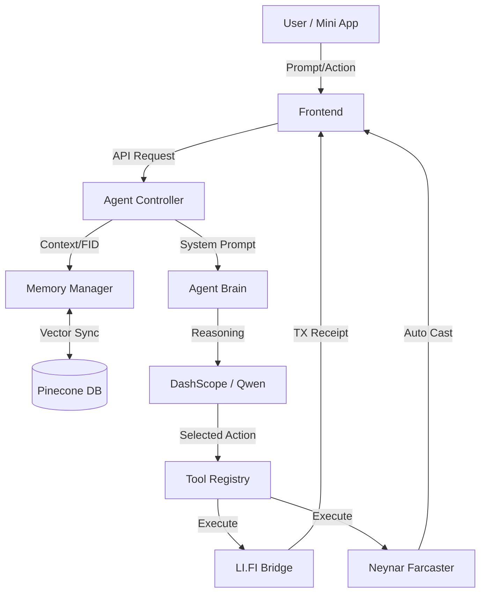

# MRX LOLCAT - Architecture Overview

## System Flow Diagram

## Modular Layers

### 1. Core Layer (`src/agent/core/`)
Agent identity, system prompt generation, and orchestration. The orchestrator coordinates memory retrieval, model selection, prompt assembly, and streaming.

### 2. Reasoning Layer (`src/agent/reasoning/`)
DashScope (Alibaba Cloud) as the sole LLM provider. Supports Qwen model family: qwen-plus, qwen-turbo, qwen-max, qwen2.5-72b-instruct.

### 3. Memory Layer (`src/agent/memory/`)
Long-term state via Pinecone vector storage. Interactions are embedded using DashScope `text-embedding-v3` (1024 dimensions) and keyed by Farcaster ID (FID).

### 4. Tools Layer (`src/agent/tools/`)
Specialized integrations: LI.FI cross-chain bridging, Neynar Farcaster publishing, and interactive frames.

### 5. Config Layer (`src/configs/`)
Centralized constants for Chain IDs, Token addresses, and Fee management (0.1% platform fee).

### 6. Providers Layer (`src/providers/`)
React context providers: Farcaster MiniApp SDK initialization, Wagmi/Reown wallet configuration.

### 7. Types Layer (`src/types/`)
Shared TypeScript interfaces for ChatMessage, ChatRequest, BridgeParams, ApiErrorResponse.

## Security
- **Non-Custodial**: User signatures handled via Wagmi/Reown.
- **Environment Driven**: All API keys via `.env`, no hardcoded secrets.
- **DashScope Only**: Single provider, no fallback chain complexity.
