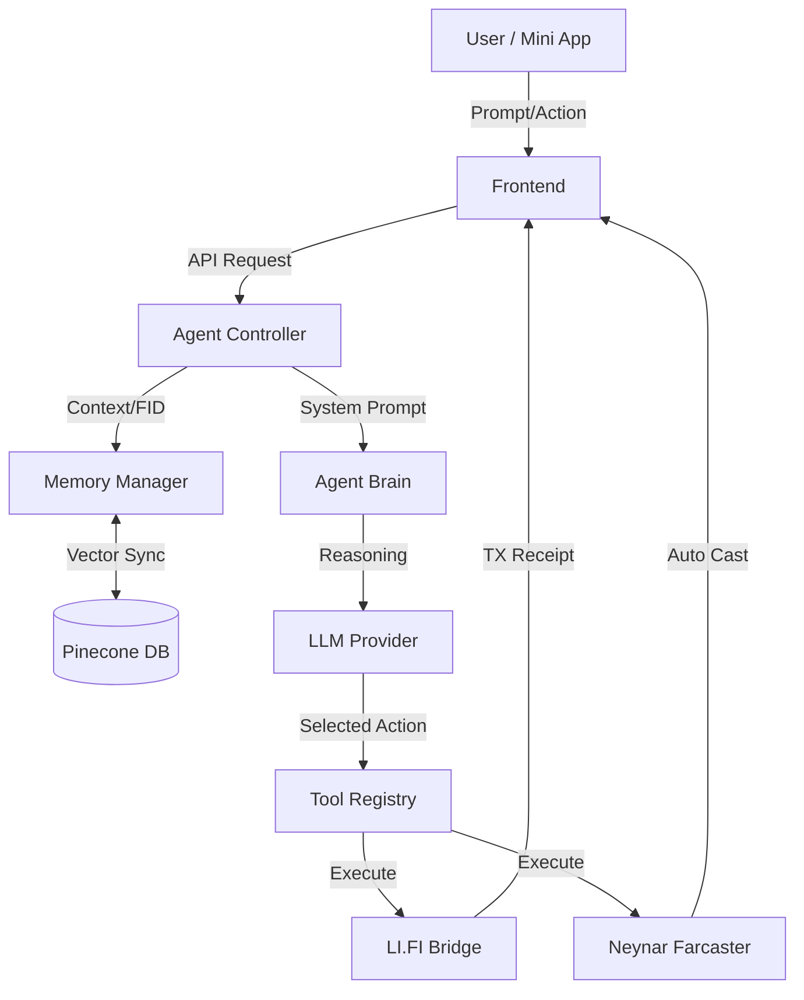

# MRX LOLCAT - Architecture Overview

## System Flow Diagram

## Modular Layers

### 1. **Core Layer (`src/agent/core/`)**
Defines the "Identity" of the agent. This includes the persona (Cowboy Cat), the system instructions, and how it translates user intent into actions.

### 2. **Reasoning Layer (`src/agent/reasoning/`)**
The decision-making hub. It handles model selection (OpenRouter, GPT-4o, Claude) and fallback logic if a provider is down.

### 3. **Memory Layer (`src/agent/memory/`)**
Maintains long-term state across sessions. Every interaction is vectorized using OpenAI embeddings and stored in Pinecone, keyed by Farcaster ID (FID).

### 4. **Tools Layer (`src/agent/tools/`)**
The operational arm. Contains specialized integrations for blockchain interactions (LI.FI), social publishing (Neynar), and interactive UI elements (Frames).

### 5. **Config Layer (`src/configs/`)**
Centralized constants for Chain IDs, Token addresses, and Fee management (0.1% platform fee to Partner Wallet).

## Data Integrity & Security
- **Non-Custodial**: User signatures are handled via Wagmi/Reown.
- **SPEx**: Statistical Proof of Execution for on-chain verification.
- **Environment Driven**: No hardcoded API keys. All configuration is injected via `.env`.
